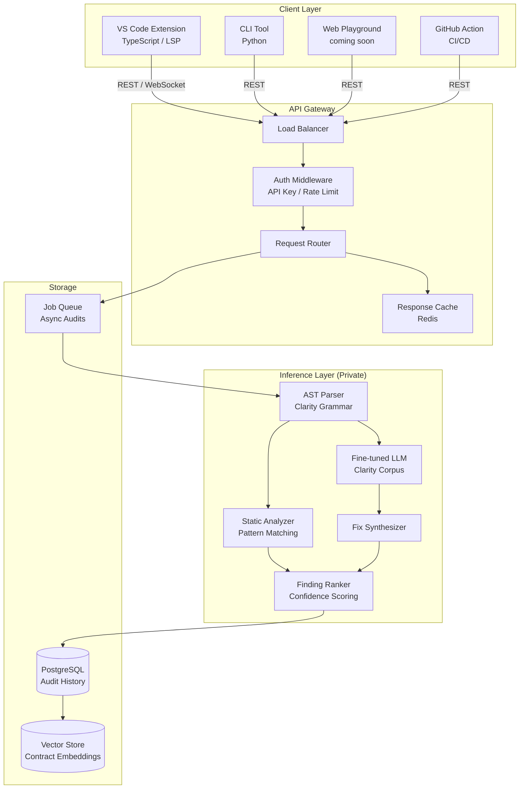
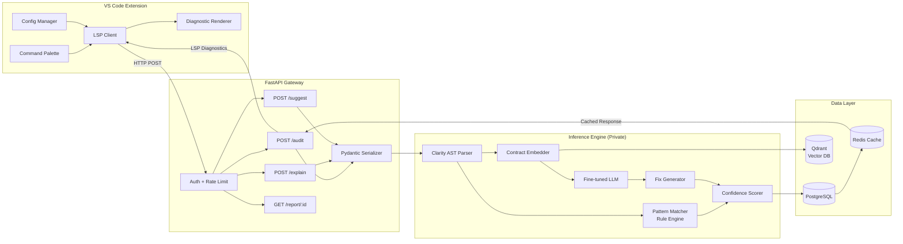
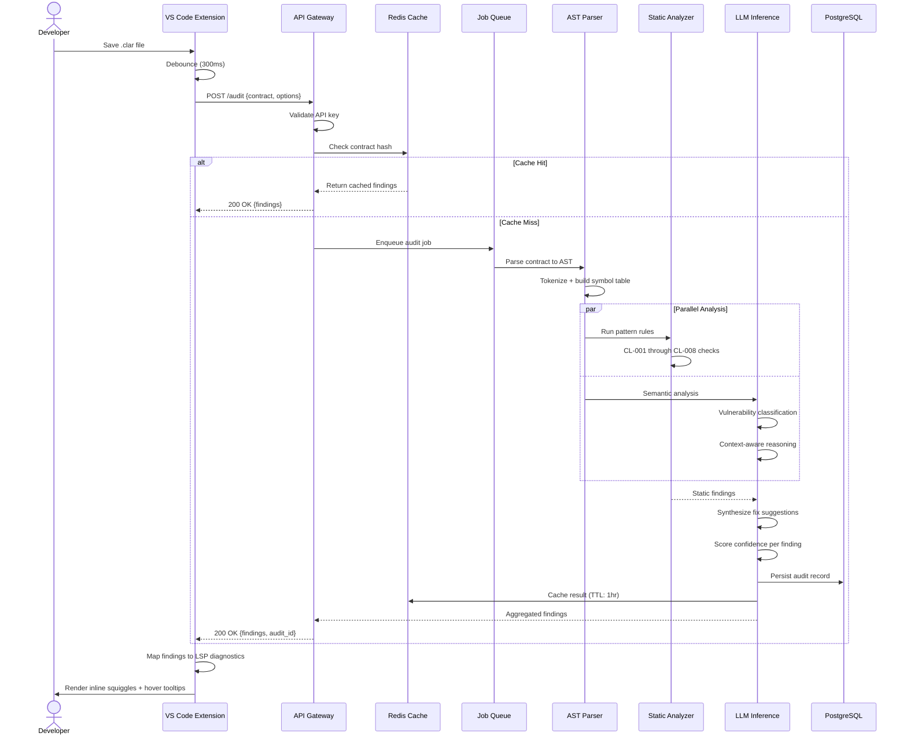
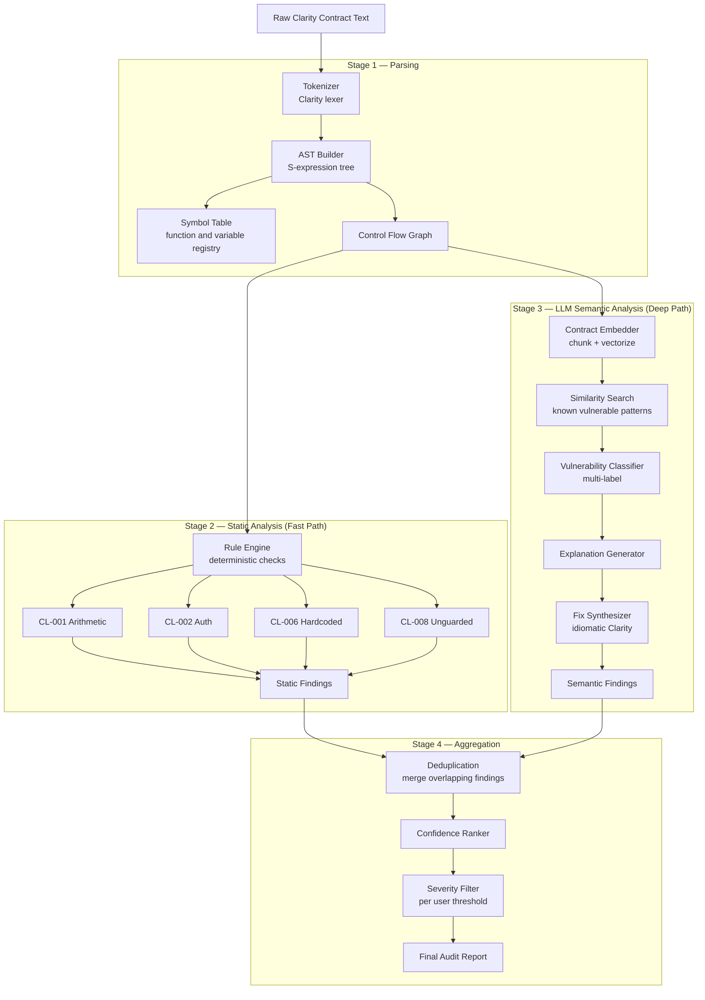
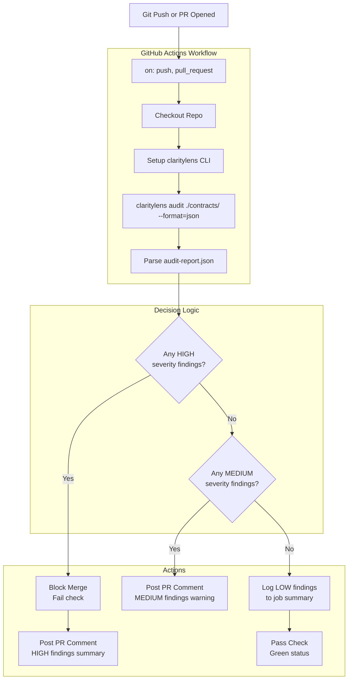
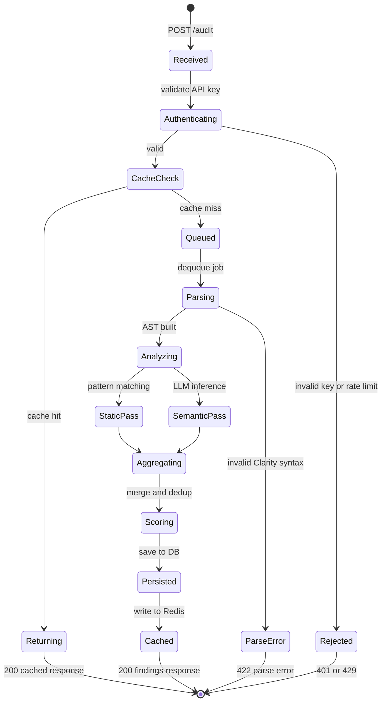
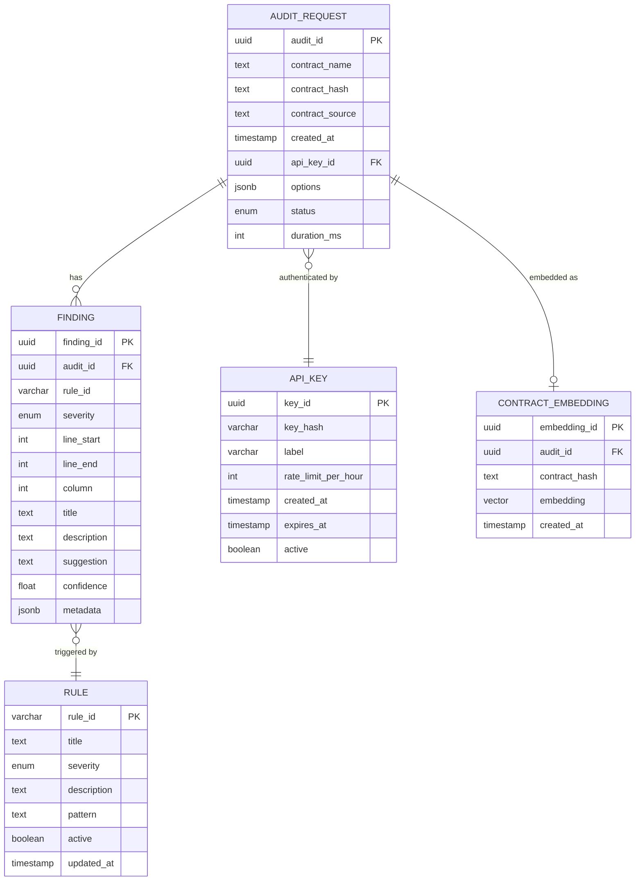

# ClarityLens

> AI-powered smart contract auditor and developer assistant for the [Clarity](https://docs.stacks.co/clarity/overview) language on the Stacks blockchain.

[](https://opensource.org/licenses/MIT)
[](https://stacks.co)
[]()
[]()

> **Note:** The core model and inference codebase are currently private and in active testing. This repository is the public-facing project home, architecture specs, VS Code extension client, and public API schema are documented here. Interested in early access? See [Early Access](#early-access).

---

## Table of Contents

- [Why ClarityLens](#why-claritylens)
- [What It Does](#what-it-does)
- [High-Level Architecture](#high-level-architecture)
- [System Component Diagram](#system-component-diagram)
- [Audit Request Flow](#audit-request-flow)
- [Inference Pipeline](#inference-pipeline)
- [Model Training Pipeline](#model-training-pipeline)
- [CI/CD Integration Flow](#cicd-integration-flow)
- [API Design](#api-design)
- [API State Machine](#api-state-machine)
- [Data Model](#data-model)
- [Vulnerability Detection](#vulnerability-detection)
- [VS Code Extension](#vs-code-extension)
- [Roadmap](#roadmap)
- [Research and Methodology](#research-and-methodology)
- [Early Access](#early-access)
- [Contributing](#contributing)
- [License](#license)

---

## Why ClarityLens

Clarity is Stacks' most powerful technical differentiator. It's decidable, non-Turing-complete, and designed from the ground up for safety and predictability. You can know, before deployment, exactly what a Clarity contract will do.

But that power comes with a steep learning curve. Clarity's unique execution model — no reentrancy by default, post-conditions, principal-based auth, explicit error handling — means developers coming from Solidity or Rust carry mental models that don't transfer cleanly. The result: subtle bugs, insecure patterns, and slow onboarding.

Every major smart contract ecosystem has AI-assisted tooling. Stacks doesn't yet.

**ClarityLens is that tool.** It doesn't just lint syntax — it understands the semantic intent of your contract and flags where your implementation diverges from safe, idiomatic Clarity patterns.

---

## What It Does

| Feature | Description |
|---|---|
| **Vulnerability Detection** | Flags known insecure patterns: unchecked inputs, improper principal authorization, unsafe arithmetic, missing post-conditions |
| **Fix Suggestions** | Inline recommendations with idiomatic rewrites, not just error messages |
| **Clarity Assistant** | Natural language questions about your contract — "what does this function do?", "is this authorization check correct?" |
| **VS Code Extension** | Real-time diagnostics as you write, no CLI required |
| **REST API** | Integrate auditing into your CI/CD pipeline programmatically |
| **Audit Reports** | Structured JSON or Markdown audit summaries per contract |

---

## High-Level Architecture



---

## System Component Diagram



---

## Audit Request Flow



---

## Inference Pipeline



---

## Model Training Pipeline

```mermaid
flowchart LR
    subgraph Collect["Data Collection"]
        MAINNET[Stacks Mainnet\nDeployed Contracts]
        SYNTHETIC[Synthetic Generator\nAdversarial Examples]
        OSS[Open Source\nClarity Repos]
    end

    subgraph Preprocess["Preprocessing"]
        NORMALIZE[Normalize + Clean]
        AST_EXTRACT[AST Extraction]
        LABEL[Vulnerability Labeling\nmanual + heuristic]
        SPLIT[Train / Val / Test Split\n80 / 10 / 10]
    end

    subgraph Train["Training"]
        BASE[Base LLM\ncode-specialized]
        FINETUNE[Fine-tuning\nClarity corpus]
        RLHF[RLHF\nfix quality feedback]
    end

    subgraph Eval["Evaluation"]
        PREC[Precision per class]
        RECALL[Recall per class]
        F1[F1 Score]
        FPR[False Positive Rate\ntarget less than 10%]
    end

    subgraph Deploy["Deployment"]
        QUANTIZE[Quantization INT8]
        SERVE[Inference Server vLLM]
        MONITOR[Drift Monitor]
    end

    MAINNET --> NORMALIZE
    SYNTHETIC --> NORMALIZE
    OSS --> NORMALIZE
    NORMALIZE --> AST_EXTRACT
    AST_EXTRACT --> LABEL
    LABEL --> SPLIT

    SPLIT --> BASE
    BASE --> FINETUNE
    FINETUNE --> RLHF

    RLHF --> PREC
    RLHF --> RECALL
    PREC & RECALL --> F1
    F1 --> FPR

    FPR -->|Pass threshold| QUANTIZE
    FPR -->|Fail| FINETUNE

    QUANTIZE --> SERVE
    SERVE --> MONITOR
    MONITOR -->|Degradation detected| FINETUNE
```



---

## CI/CD Integration Flow



---

## API Design

### Endpoints

```
POST   /v1/audit            Run a full vulnerability audit
POST   /v1/explain          Natural language contract explanation
POST   /v1/suggest          Get idiomatic fix for flagged code
GET    /v1/report/:id       Retrieve a stored audit report
GET    /v1/rules            List all active vulnerability rules
POST   /v1/batch            Submit multiple contracts for async audit
GET    /v1/batch/:job_id    Poll batch job status
DELETE /v1/report/:id       Delete an audit record
```

### POST /v1/audit

**Request**
```json
{
  "contract": "(define-public (transfer (amount uint) (recipient principal)) ...)",
  "contract_name": "my-token",
  "options": {
    "severity_threshold": "low",
    "include_suggestions": true,
    "include_explanation": false,
    "rules": ["CL-001", "CL-002", "CL-004"]
  }
}
```

**Response**
```json
{
  "audit_id": "aud_7f3k2m",
  "contract_name": "my-token",
  "status": "complete",
  "duration_ms": 340,
  "findings": [
    {
      "id": "CL-002",
      "title": "Missing principal authorization",
      "severity": "high",
      "line_start": 3,
      "line_end": 7,
      "column": 1,
      "description": "The transfer function modifies token balances without verifying that tx-sender is the token owner.",
      "suggestion": "Add (asserts! (is-eq tx-sender sender) ERR-NOT-AUTHORIZED) before state mutation.",
      "confidence": 0.94,
      "references": ["https://docs.stacks.co/clarity/security/principals"]
    }
  ],
  "summary": {
    "total": 1,
    "high": 1,
    "medium": 0,
    "low": 0,
    "info": 0
  }
}
```

### POST /v1/explain

**Request**
```json
{
  "contract": "...",
  "target": "transfer",
  "detail_level": "standard"
}
```

**Response**
```json
{
  "target": "transfer",
  "explanation": "This function allows any principal to transfer tokens from their own balance to a recipient, provided the amount is positive and the sender has sufficient funds.",
  "inputs": [
    { "name": "amount", "type": "uint", "description": "Number of tokens to transfer" },
    { "name": "recipient", "type": "principal", "description": "Receiving address" }
  ],
  "outputs": { "type": "response bool uint", "description": "ok true on success, err code on failure" },
  "side_effects": ["Modifies token-balances data map", "Emits transfer event"]
}
```

### POST /v1/suggest

**Request**
```json
{
  "contract": "...",
  "finding_id": "CL-001",
  "target_lines": [12, 15]
}
```

**Response**
```json
{
  "finding_id": "CL-001",
  "original": "(+ balance amount)",
  "suggested": "(unwrap! (checked-add balance amount) ERR-OVERFLOW)",
  "diff": "- (+ balance amount)\n+ (unwrap! (checked-add balance amount) ERR-OVERFLOW)",
  "explanation": "Use checked arithmetic to prevent silent integer overflow."
}
```

---

## API State Machine



---

## Data Model



---

## Vulnerability Detection

| ID | Vulnerability | Severity | Description |
|---|---|---|---|
| CL-001 | Unchecked arithmetic | HIGH | Integer overflow/underflow not guarded with `checked-add` or explicit bounds |
| CL-002 | Missing principal authorization | HIGH | Functions that modify state without validating `tx-sender` or `contract-caller` |
| CL-003 | Unsafe `unwrap!` usage | MEDIUM | Using `unwrap!` where failure modes are undocumented or unexpected |
| CL-004 | Missing post-conditions | MEDIUM | STX or token transfers without post-conditions on the calling transaction |
| CL-005 | Reentrancy-equivalent patterns | HIGH | Inter-contract calls that modify state before returning |
| CL-006 | Hardcoded principals | LOW | Contract addresses as literals rather than defined constants |
| CL-007 | Improper error handling | MEDIUM | Error codes not consistently defined across contract functions |
| CL-008 | Unguarded public functions | HIGH | Public functions that mutate data maps without access control |

---

## VS Code Extension

**Features:**
- Inline squiggles and diagnostics mapped to the Problems panel
- Hover tooltips with finding description and suggested fix
- Command palette: `ClarityLens: Audit Current File`, `ClarityLens: Explain Function`
- Status bar showing audit state (clean / warnings / errors)

**Installation** *(coming soon — pending public beta)*
```bash
ext install claritylens
# or
code --install-extension claritylens-0.1.0.vsix
```

**Configuration (`settings.json`)**
```json
{
  "claritylens.apiKey": "your-api-key",
  "claritylens.auditOnSave": true,
  "claritylens.severityThreshold": "medium",
  "claritylens.endpoint": "https://api.claritylens.dev"
}
```

---

## Roadmap

**Phase 1 — Foundation** *(In progress)*
- [x] Project scaffolding and public repo
- [ ] Clarity contract dataset curation and labeling (~50k contracts)
- [ ] Vulnerability classifier v1 (8 rule classes)
- [ ] Internal evaluation suite

**Phase 2 — Build**
- [ ] FastAPI inference gateway
- [ ] VS Code extension client (LSP-compatible)
- [ ] CLI tool
- [ ] GitHub Action for CI/CD integration

**Phase 3 — Ship**
- [ ] Public beta launch
- [ ] VS Code Marketplace listing
- [ ] Documentation site
- [ ] Technical blog posts for the Stacks community

**Phase 4 — Grow** *(post-grant)*
- [ ] Web playground
- [ ] Multi-contract project audits
- [ ] Clarinet integration
- [ ] Custom rule definitions for teams

---

## Research and Methodology

ClarityLens is built on a foundation of applied ML security research:

- Adversarially resilient model design — [IEEE HiPC 2024](https://ieeexplore.ieee.org/)
- Distributed, fault-tolerant inference pipelines — [IEEE SMC 2025](https://ieeexplore.ieee.org/)
- Risk-aware prioritization under uncertainty — [IEEE CCGrid 2026](https://ieeexplore.ieee.org/)

The model is fine-tuned on a labeled corpus of Clarity contracts from Stacks mainnet deployments, augmented with synthetically generated vulnerable examples. Evaluation targets **>90% precision** on high-severity findings — a deliberate design choice to minimize false-positive noise. A tool developers don't trust, they don't use.

---

## Early Access

The core inference model and API are in private testing. If you're a developer building on Stacks, a researcher interested in Clarity security, or a protocol team wanting CI/CD integration — reach out.

**Email:** nidhis@iitbhilai.ac.in  
**Issues:** Open one with the `early-access` label

---

## Contributing

Contributions to public components (VS Code extension, CLI, docs) are welcome once the initial release ships.

- Star the repo to follow progress
- Open issues for feature requests or questions
- Reach out for research collaboration

---

## License

MIT License — see [LICENSE](./LICENSE) for details.

The core ML model and training data remain proprietary during the private beta period.

---

<p align="center">Built for the Stacks ecosystem by <a href="https://github.com/Nidhicodes">Nidhi Singh</a></p>
