<div align="center">

# ClarityLens

### AI-Powered Smart Contract Auditor for the Stacks Ecosystem

[](https://opensource.org/licenses/MIT)
[](https://stacks.co)
[]()
[]()
[](https://ieeexplore.ieee.org/)

[Early Access](#early-access) · [Architecture](#high-level-architecture) · [API Docs](#api-design) · [Roadmap](#roadmap)

</div>

---

> **Private Beta:** The core model and inference codebase are currently private and under active testing. This repository is the public project home — architecture, API schema, VS Code extension client, and documentation live here and are released progressively. See [Early Access](#early-access) to get involved.

---

## The Problem

Stacks ranked **#5 among the world's fastest-growing developer ecosystems in 2025** (Electric Capital). The sBTC TVL surpassed $600M. Clarity 4 activated. Institutional integrations from Circle, BitGo, and Wormhole arrived. The ecosystem is growing fast.

But there's a gap.

Every developer writing Clarity contracts today faces the same problem: **there is no AI-assisted security tooling**. The only existing option is [STACY](https://www.coinfabrik.com/products/stacy-for-stacks-clarity-static-analyzer/) — a rule-based static analyzer built by CoinFabrik. STACY is valuable, but it has fundamental limitations inherent to all rule-based systems:

| Limitation | Impact |
|---|---|
| Rules only catch *known* patterns | Novel vulnerabilities pass through |
| No semantic understanding | Business logic flaws are invisible |
| No fix suggestions | Developer still has to figure out *how* to fix |
| No natural language interface | High barrier for developers new to Clarity |
| High false-positive rates | Alert fatigue; developers tune out warnings |
| No IDE integration | Friction in the development workflow |

Research is clear on this gap. Recent benchmarks show that LLM-augmented analysis achieves **F1 scores of 0.75–0.87** versus **0.26–0.55** for pure static tools — a near 3× improvement in finding real vulnerabilities while maintaining developer trust through lower false-positive rates.

**ClarityLens closes this gap for Stacks.** It combines a fast deterministic pre-pass for known patterns with a fine-tuned LLM that understands Clarity's semantic intent — then generates idiomatic fix suggestions in plain language. It integrates directly into the developer's IDE and CI pipeline, so security feedback arrives at the moment it's most actionable: *while writing code, not after deployment*.

The timing matters. As Stacks DeFi scales toward $1B TVL, as institutional capital arrives, as sBTC becomes the backbone of Bitcoin-secured finance — the cost of a single exploited contract scales with it. Security tooling is no longer optional infrastructure. It's table stakes.

---

## Why This Couldn't Be Built Anywhere Else

The Stacks Endowment asks that funded projects leverage what makes Stacks unique. ClarityLens is built entirely around Clarity's properties:

**Clarity is interpreted, not compiled** — contracts exist on-chain exactly as written. This means ClarityLens can operate directly on source, with no bytecode decompilation step, no compiler abstraction layer to reason through. The analysis is clean and auditable.

**Clarity is decidable** — static analysis of Clarity contracts can make stronger guarantees than analysis of Turing-complete languages. ClarityLens takes advantage of this: its rule engine can reason precisely about execution paths in ways that are impossible in Solidity.

**Clarity has explicit post-conditions** — ClarityLens specifically audits whether transactions include appropriate post-conditions, a Clarity-native safety mechanism that has no equivalent elsewhere.

**Clarity's principal-based auth model** — ClarityLens understands `tx-sender`, `contract-caller`, and the differences between them, and flags auth patterns that are correct in other languages but dangerous in Clarity's execution model.

This is not a generic "smart contract security tool" ported to Clarity. It's built *for* Clarity's properties.

---

## What It Does

| Feature | Description |
|---|---|
| **Hybrid Vulnerability Detection** | Two-stage: fast AST-based rule pass + deep LLM semantic analysis |
| **Fix Suggestions** | Idiomatic Clarity rewrites with explanations, not just error codes |
| **Clarity Assistant** | Natural language Q&A about your contract — intent, behavior, risks |
| **VS Code Extension** | Real-time inline diagnostics via LSP, no context switching |
| **REST API** | Programmatic access for CI/CD integration |
| **Structured Audit Reports** | JSON or Markdown summaries per contract, shareable with teams |
| **Confidence Scoring** | Every finding comes with a confidence score to help prioritize |

---

## High-Level Architecture


---

## System Component Diagram


---

## Audit Request Flow

```mermaid
sequenceDiagram
    actor Dev as Developer
    participant EXT as VS Code Extension
    participant GW as API Gateway
    participant CACHE as Redis
    participant QUEUE as Job Queue
    participant AST as AST Parser
    participant SA as Static Analyzer
    participant LLM as LLM Inference
    participant DB as PostgreSQL

    Dev->>EXT: Save .clar file
    EXT->>EXT: Debounce (300ms)
    EXT->>GW: POST /v1/audit {contract_source, options}
    GW->>GW: Validate API key + check rate limit
    GW->>CACHE: Lookup by SHA-256(contract_source)

    alt Cache Hit (same contract, <1hr)
        CACHE-->>GW: Cached findings
        GW-->>EXT: 200 OK {findings, cached: true}
    else Cache Miss
        GW->>QUEUE: Enqueue audit job (job_id)
        QUEUE->>AST: Parse contract text
        AST->>AST: Tokenize → S-expression tree → Symbol table → CFG

        par Stage 2a — Fast Static Pass
            AST->>SA: Run deterministic rule checks
            SA->>SA: CL-001 Arithmetic / CL-002 Auth / CL-004 Post-conditions
            SA->>SA: CL-005 Reentrancy / CL-006 Hardcoded / CL-008 Unguarded
        and Stage 2b — Deep Semantic Pass
            AST->>LLM: Contract AST + symbol table
            LLM->>LLM: Multi-label vulnerability classification
            LLM->>LLM: Business logic reasoning
            LLM->>LLM: Confidence scoring per finding
        end

        SA-->>LLM: Static findings (pre-filter)
        LLM->>LLM: Fix synthesis for all findings
        LLM->>LLM: Deduplication + ranking
        LLM->>DB: Persist audit record
        LLM->>CACHE: Cache result (TTL: 1hr)
        LLM-->>GW: {findings[], summary, audit_id, duration_ms}
        GW-->>EXT: 200 OK
    end

    EXT->>EXT: Map findings → LSP DiagnosticCollection
    EXT->>Dev: Inline squiggles + hover tooltips
```



---

## Inference Pipeline

```mermaid
flowchart TD
    IN["Raw Clarity Contract Source"]

    subgraph S1["Stage 1 — Parsing"]
        T["Lexer + Tokenizer\nClarity grammar"]
        A["AST Builder\nS-expression tree"]
        SYM["Symbol Table\nfunctions, variables, constants, maps"]
        CFG["Control Flow Graph\nexecution path analysis"]
        T --> A --> SYM & CFG
    end

    subgraph S2["Stage 2a — Static Analysis (Fast, Deterministic)"]
        RE["Rule Engine"]
        C1["CL-001\nUnchecked arithmetic"]
        C2["CL-002\nMissing principal auth"]
        C4["CL-004\nMissing post-conditions"]
        C5["CL-005\nReentrancy-equivalent"]
        C6["CL-006\nHardcoded principals"]
        C8["CL-008\nUnguarded public functions"]
        SF["Static Findings\n{rule_id, line, confidence: 1.0}"]
        RE --> C1 & C2 & C4 & C5 & C6 & C8 --> SF
    end

    subgraph S3["Stage 2b — LLM Semantic Analysis (Deep, Contextual)"]
        EM["Contract Embedder\nchunk + vectorize"]
        VS["Vector Similarity Search\nknown vulnerable patterns in Qdrant"]
        CL["Multi-label Classifier\nvulnerability categories + severity"]
        EX["Explanation Generator\nplain-language finding descriptions"]
        FX["Fix Synthesizer\nidiomatic Clarity rewrites"]
        DF["Semantic Findings\n{finding, explanation, suggestion, confidence}"]
        EM --> VS --> CL --> EX --> FX --> DF
    end

    subgraph S4["Stage 3 — Aggregation"]
        DD["Deduplication\nmerge overlapping findings by line range"]
        RK["Confidence Ranker\nsort by severity × confidence"]
        FL["Severity Filter\nper user threshold"]
        RPT["Audit Report\n{findings[], summary, audit_id}"]
        DD --> RK --> FL --> RPT
    end

    IN --> T
    CFG --> RE
    CFG --> EM
    SF --> DD
    DF --> DD
```



---

## Model Training Pipeline


---

## CI/CD Integration Flow


---

## API Design

### Endpoints

| Method | Path | Description |
|---|---|---|
| `POST` | `/v1/audit` | Full vulnerability audit — returns findings, severity, suggestions |
| `POST` | `/v1/explain` | Natural language explanation of a contract or function |
| `POST` | `/v1/suggest` | Idiomatic Clarity rewrite for a flagged code block |
| `GET` | `/v1/report/:id` | Retrieve a previously stored audit report |
| `GET` | `/v1/rules` | List all active vulnerability rules and their descriptions |
| `POST` | `/v1/batch` | Submit multiple contracts for async parallel audit |
| `GET` | `/v1/batch/:job_id` | Poll async batch job status |
| `DELETE` | `/v1/report/:id` | Delete an audit record |

---

### POST /v1/audit

**Request**
```json
{
  "contract": "(define-public (transfer (amount uint) (recipient principal))\n  (begin\n    (var-set balance (+ (var-get balance) amount))\n    (ok true)))",
  "contract_name": "my-token",
  "options": {
    "severity_threshold": "low",
    "include_suggestions": true,
    "include_explanation": true,
    "rules": ["CL-001", "CL-002", "CL-004", "CL-008"]
  }
}
```

**Response**
```json
{
  "audit_id": "aud_7f3k2m9x",
  "contract_name": "my-token",
  "status": "complete",
  "cached": false,
  "duration_ms": 312,
  "findings": [
    {
      "id": "CL-002",
      "title": "Missing principal authorization",
      "severity": "high",
      "line_start": 1,
      "line_end": 4,
      "column": 1,
      "description": "The `transfer` function modifies state without verifying the caller is authorized. Any tx-sender can invoke this and modify balances.",
      "suggestion": "(asserts! (is-eq tx-sender contract-owner) ERR-NOT-AUTHORIZED)",
      "confidence": 0.97,
      "references": ["https://docs.stacks.co/clarity/security/principals"]
    },
    {
      "id": "CL-001",
      "title": "Unchecked arithmetic",
      "severity": "high",
      "line_start": 3,
      "line_end": 3,
      "column": 18,
      "description": "Direct use of `+` on uint values can silently overflow. Clarity does abort on overflow, but explicit checked arithmetic communicates intent and is a required pattern in audited contracts.",
      "suggestion": "(unwrap! (checked-add (var-get balance) amount) ERR-OVERFLOW)",
      "confidence": 0.89,
      "references": ["https://docs.stacks.co/clarity/language-functions#checked-add"]
    }
  ],
  "summary": {
    "total": 2,
    "high": 2,
    "medium": 0,
    "low": 0,
    "info": 0
  }
}
```

---

### POST /v1/explain

**Request**
```json
{
  "contract": "...",
  "target": "transfer",
  "detail_level": "standard"
}
```

**Response**
```json
{
  "target": "transfer",
  "type": "public-function",
  "explanation": "This function allows any principal to add an arbitrary amount to the contract's balance variable and unconditionally return success. It does not verify caller identity, validate input bounds, or emit events — making it unsafe for production use.",
  "inputs": [
    { "name": "amount", "type": "uint", "description": "Quantity to add to balance" },
    { "name": "recipient", "type": "principal", "description": "Declared but unused in current implementation" }
  ],
  "outputs": { "type": "(response bool uint)", "on_success": "true", "on_failure": "error uint" },
  "side_effects": ["Modifies `balance` data variable"],
  "risks": ["No access control", "Unused parameter suggests incomplete implementation"]
}
```

---

### POST /v1/suggest

**Request**
```json
{
  "contract": "...",
  "finding_id": "CL-001",
  "target_lines": [3, 3]
}
```

**Response**
```json
{
  "finding_id": "CL-001",
  "original": "(var-set balance (+ (var-get balance) amount))",
  "suggested": "(var-set balance (unwrap! (checked-add (var-get balance) amount) ERR-OVERFLOW))",
  "diff": "- (var-set balance (+ (var-get balance) amount))\n+ (var-set balance (unwrap! (checked-add (var-get balance) amount) ERR-OVERFLOW))",
  "explanation": "Replace bare `+` with `checked-add`, which returns `(some result)` on success and `none` on overflow. `unwrap!` converts `none` to an explicit error code. Define `ERR-OVERFLOW` as `(define-constant ERR-OVERFLOW (err u100))` at the top of your contract."
}
```

---

## API State Machine


---

## Data Model


---

## Vulnerability Detection

### Current Rule Set (v0.1)

| ID | Class | Severity | Detection Method | Description |
|---|---|---|---|---|
| CL-001 | Unchecked arithmetic | **HIGH** | Static + Semantic | Direct use of `+`, `-`, `*` on uint without `checked-*` wrappers |
| CL-002 | Missing principal authorization | **HIGH** | Semantic | State-mutating public functions that don't assert `tx-sender` or `contract-caller` |
| CL-003 | Unsafe `unwrap!` usage | **MEDIUM** | Static | `unwrap!` with panic-inducing error codes on paths that can be triggered externally |
| CL-004 | Missing post-conditions | **MEDIUM** | Semantic | STX/token transfers without corresponding post-conditions in the calling transaction |
| CL-005 | Reentrancy-equivalent | **HIGH** | Semantic | Inter-contract calls before state updates — exploitable despite Clarity's partial reentrancy guard |
| CL-006 | Hardcoded principals | **LOW** | Static | Contract addresses as literals rather than `define-constant` — upgrade risk |
| CL-007 | Inconsistent error codes | **MEDIUM** | Static | Error uint values reused across different failure conditions, obscuring debugging |
| CL-008 | Unguarded public functions | **HIGH** | Semantic | Public functions mutating data-maps without any access control pattern |

### Detection Accuracy Targets (v0.1)

| Severity | Precision Target | Recall Target | Max FPR |
|---|---|---|---|
| HIGH | ≥ 92% | ≥ 80% | ≤ 8% |
| MEDIUM | ≥ 85% | ≥ 75% | ≤ 15% |
| LOW | ≥ 80% | ≥ 70% | ≤ 20% |

*Targets are based on an internal held-out test set of 5,000 labeled Clarity contracts. Full eval results will be published at beta launch.*

---

## VS Code Extension

The ClarityLens VS Code extension provides real-time security feedback with zero workflow friction.

### Features
- Inline squiggles on vulnerable lines, mapped to the Problems panel
- Rich hover tooltips: finding description, severity badge, suggested fix with diff view
- `ClarityLens: Audit File` — on-demand full audit of the active file
- `ClarityLens: Explain Function` — select any function, get a plain-language explanation
- `ClarityLens: Apply Suggestion` — one-click apply of a suggested fix (with undo)
- Status bar item: shows audit state (Clean / Warnings / Errors)

### Installation *(pending public beta)*
```bash
# VS Code Marketplace (coming soon)
ext install claritylens

# Manual VSIX install
code --install-extension claritylens-0.1.0.vsix
```

### Configuration (`settings.json`)
```json
{
  "claritylens.apiKey": "cl_your_api_key_here",
  "claritylens.auditOnSave": true,
  "claritylens.auditDebounceMs": 300,
  "claritylens.severityThreshold": "medium",
  "claritylens.endpoint": "https://api.claritylens.dev",
  "claritylens.showConfidenceScores": true,
  "claritylens.autoApplySuggestions": false
}
```

---

## Roadmap

### Phase 1 — Foundation *(Month 1)*
- [x] Public repo and project documentation
- [ ] Clarity contract dataset: scrape and label ~50k mainnet contracts
- [ ] Vulnerability taxonomy: finalize CL-001 through CL-008 with labeled examples
- [ ] Baseline classifier: fine-tune on Clarity corpus, establish eval benchmarks
- [ ] Internal test suite: 5,000 labeled contracts for precision/recall measurement

**Deliverable:** Trained model checkpoint with >90% precision on HIGH severity findings, published eval results.

### Phase 2 — Build *(Month 2)*
- [ ] FastAPI gateway: `/audit`, `/explain`, `/suggest`, `/report` endpoints
- [ ] VS Code extension: LSP client, diagnostic rendering, hover tooltips
- [ ] CLI tool: `claritylens audit`, `claritylens explain`, `--format=json` output
- [ ] GitHub Action: ready-to-use workflow for CI/CD integration
- [ ] API authentication: key management, rate limiting, usage tracking

**Deliverable:** Working end-to-end system. API accessible, VS Code extension installable, GitHub Action published.

### Phase 3 — Ship *(Month 3)*
- [ ] Public beta launch — open API access, VS Code Marketplace listing
- [ ] Documentation site — quickstart, API reference, integration guides
- [ ] Clarinet plugin — native integration with the standard Stacks CLI
- [ ] Stacks community outreach — forum posts, office hours, feedback collection
- [ ] Two technical blog posts: methodology + a deep-dive on a real vulnerability caught in a mainnet contract

**Deliverable:** Public beta with ≥50 active developers in the first month, community feedback loop established.

### Phase 4 — Grow *(Post-grant, self-sustaining)*
- [ ] Web playground — audit any contract from a browser, no install required
- [ ] Multi-contract project audits — analyze contract dependencies together
- [ ] Custom rule definitions — teams can write and share their own detection rules
- [ ] Audit history dashboard — track security posture across a project over time
- [ ] SaaS tier for teams — sustains ongoing infrastructure costs

---

## Research & Methodology

ClarityLens is built on a foundation of peer-reviewed ML security research. The vulnerability detection architecture directly applies three published approaches:

**Adversarially Resilient Model Design** — [IEEE HiPC 2024](https://ieeexplore.ieee.org/)
The model training methodology for ClarityLens draws from work on cost-sensitive learning to maintain detection accuracy under adversarial conditions — relevant here because sophisticated contract vulnerabilities are often designed to evade pattern-based detection.

**Distributed, Fault-Tolerant Inference Pipelines** — [IEEE SMC 2025](https://ieeexplore.ieee.org/)
The two-stage inference architecture (fast static pre-pass + deep LLM semantic pass) is informed by research on hierarchical, asynchronous systems — ensuring ClarityLens stays responsive under load without degrading analysis quality.

**Risk-Aware Prioritization Under Uncertainty** — [IEEE CCGrid 2026](https://ieeexplore.ieee.org/)
ClarityLens's confidence scoring and severity ranking system applies quantum-safe risk prioritization techniques to smart contract findings — ensuring HIGH severity findings surface reliably even when the model is uncertain.

**Why these papers matter to the grant:** This is not a "vibe-coded" wrapper around a general LLM. The vulnerability detection logic is grounded in published, peer-reviewed methodology. The model will be evaluated rigorously, and the eval results will be published openly.

---

## Competitive Landscape

| Tool | Type | Fix Suggestions | IDE Integration | Stacks-specific | AI/Semantic |
|---|---|---|---|---|---|
| **STACY** (CoinFabrik) | Static analyzer | No | No | Yes | No |
| **Clarinet** (Hiro) | Dev CLI + linter | No | Partial | Yes | No |
| **Slither** (Ethereum) | Static analyzer | No | Partial | No | No |
| **Aderyn** (Cyfrin) | Static analyzer | No | No | No | No |
| **ClarityLens** | AI-hybrid auditor | Yes | Yes | Yes | Yes |

ClarityLens is not competing with STACY or Clarinet — it is **complementary**. STACY and Clarinet catch known deterministic patterns fast. ClarityLens catches what they miss: business logic flaws, novel vulnerability patterns, and authorization errors that require understanding the contract's *intent*. The plan is to integrate ClarityLens output as an optional step in Clarinet's workflow, not replace it.

---

## Long-Term Sustainability

ClarityLens is designed to remain active in the Stacks ecosystem indefinitely, not as a grant-funded project that disappears after delivery.

**Open source core:** All detection rules, the VS Code extension, and the CLI will be MIT-licensed. The community can contribute new vulnerability classes.

**Community-driven rule growth:** A public GitHub repo for rule submissions means the detection surface grows with the ecosystem. As new Clarity patterns emerge (sBTC integrations, new SIPs), the community can add detection rules without depending on a single maintainer.

**Self-sustaining revenue:** A free tier covers individual developers and open-source projects. A paid tier for teams and protocols requiring higher API volume, audit history, and custom rules covers infrastructure costs post-grant.

**Personal commitment:** I graduate from IIT Bhilai in May 2026 and intend to remain active in the Stacks ecosystem beyond this grant. ClarityLens is not a side project — it's the beginning of a sustained contribution to Stacks developer infrastructure.

---

## Early Access

The core inference API is in private testing. If you're a developer building on Stacks, a security researcher, or a protocol team who wants to integrate auditing into your CI pipeline before public launch, reach out.

**Email:** nidhis@iitbhilai.ac.in  
**Issues:** Open one with the `early-access` label  
**Stacks Forum:** Will be posted in the builders section once beta is ready

---

## Contributing

Contributions to public components (VS Code extension, CLI, documentation, detection rules) are welcome once the initial beta ships.

- * Star the repo to track progress
- 🐛 Open issues for feature requests, questions, or vulnerability class suggestions
- 📬 Reach out for research collaboration or ecosystem partnerships

---

## License

MIT License — see [LICENSE](./LICENSE) for details.

The core ML model weights and training dataset are proprietary during the private beta period. All tooling (extension, CLI, API schema) is open source.

---

<div align="center">

Built for the Stacks ecosystem

[github.com/Nidhicodes/claritylens](https://github.com/Nidhicodes/claritylens) · nidhis@iitbhilai.ac.in

</div>
